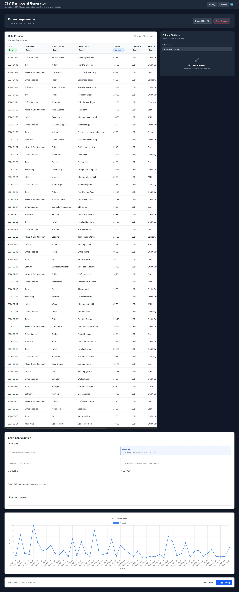

# Spread Your Sheets

> The repository is currently named `csv-dashgen`. **Spread Your Sheets** is the public product name being introduced as part of an active relaunch. Source paths, package names, and storage keys still reference the old name and will be updated in a later branch.

**Status:** Active relaunch in progress.

**Private CSV exploration with instant summaries, column profiles, and chart ideas.**

Drop in a CSV or TSV file and quickly understand what's inside. Your data is processed locally in your browser.

Planned public URL: `spreadyoursheets.slightlyprivate.com`



> **Note:** `docs/dashboard.png` and `docs/upload.png` predate the
> `feature/signature-ux` visual redesign (new sidebar navigation, quick-read
> summary, chart-idea cards, column checkup, restyled preview table, amber/dark
> theme). They're kept as historical reference until refreshed screenshots are
> captured in the release branch — see [`docs/screenshots.md`](docs/screenshots.md).

## Current capabilities

Everything below runs today, client-side, in the app under [`web/`](web):

- Drag-and-drop CSV/TSV upload with validation (file type, size, row count, column count, duplicate headers)
- Sample dataset loading (see [`samples/`](samples))
- Automatic column type inference (number, string, date, boolean, unknown) with manual override in the UI
- A "quick read" dataset overview (row/column counts, type breakdown, missing-value summary, date range, top category, and a data-quality note) shown before the detailed table
- Ranked chart suggestions (trend, compare, relationship, distribution) with one-click chart creation, alongside manual chart configuration
- Data preview table with sorting, filtering, pagination, sticky header, and inline type editing
- Per-column inspector ("Column checkup") with quality stats, a distribution histogram for numeric columns, quartiles, top values for categorical columns, and date range for date columns
- Chart generation: line, bar, pie, scatter, and a numeric distribution (histogram) view
- Chart export as a PNG image
- Light/dark/system theme toggle, including a proper class-based dark mode (previously the `dark:` utility classes only responded to OS-level preference, not the in-app toggle)
- Local persistence of dataset, chart config, and column types via `localStorage`, gated by a real "Enable Data Persistence" setting
- Privacy notice and settings modals — truthful, static info panels with no fake toggles; no modal-first privacy gate on load
- Sidebar section navigation (Overview/Columns/Charts/Data) with scroll-spy highlighting
- CI pipeline (lint, build, test) on push/PR

All processing happens in the browser. There is no backend in the current build or repo, and no data leaves the device.

## Partial / in-progress capabilities

These exist in some form but are not finished:

- **Accessibility** — good baseline practices (labeled controls, ARIA attributes, focus-visible styling), plus a focus trap and Escape-to-close on all modals (Settings, Privacy, Help), but still no dedicated accessibility test suite. This is **not** a certified WCAG 2.1 AA-compliant implementation
- **Test coverage** — unit tests for parsing, statistics, chart suggestion/rendering logic, and a basic uploader render test; no integration or end-to-end coverage of the full upload → preview → chart flow

## Planned / future capabilities

Not implemented yet — tracked as relaunch roadmap items, not current features:

- Processed data export (CSV/JSON)
- Additional chart export formats (for example SVG)
- Optional backend processing for larger files (no backend scaffolding exists in this repo today — it would be built fresh from a real requirement)
- Natural-language data summaries, saved dashboards, and other longer-term ideas (see Roadmap below)

## Tech stack

### Frontend (implemented)

- React 18 with functional components and hooks
- TypeScript (strict mode)
- Vite for dev server and production builds
- Tailwind CSS v4
- Chart.js with react-chartjs-2
- PapaParse for CSV parsing
- Vitest + React Testing Library

### Backend (not implemented — planned only)

There is no backend scaffolding in this repository. The current relaunch direction is **frontend-only, browser-local processing**; a backend would only be added later from a concrete requirement.

## Quick start

The runnable app lives entirely under [`web/`](web). There is no root-level `npm` project.

```bash
git clone https://github.com/YOURUSER/csv-dashgen
cd csv-dashgen/web

npm install
npm run dev

# Open http://localhost:5173 in your browser
```

## Testing and linting

Run these from inside `web/`:

```bash
cd web

npm test              # run tests once (watch mode by default with vitest)
npm run test:coverage # run tests with coverage report
npm run lint          # lint
npm run lint:fix      # lint with auto-fix
```

Coverage is real but narrow — see "Partial / in-progress capabilities" above.

## Project structure

```text
csv-dashgen/
├── web/                          # The actual application (frontend-only)
│   ├── src/
│   │   ├── components/           # Uploader, DataPreview, ColumnsList, ColumnProfile, Chart, Settings, etc.
│   │   ├── contexts/              # ConfigContext, ThemeContext, ToastContext
│   │   ├── hooks/                 # useConfig, useLimits, usePersistentState, useTheme, useToast
│   │   ├── lib/                   # Data-core: csv, profiling, statistics, charts, storage
│   │   ├── types/                 # Shared domain types (dataset, charts, config)
│   │   ├── App.tsx                # Main application component
│   │   └── main.tsx               # Application entry point
│   ├── public/                    # Static assets
│   ├── vite.config.ts
│   ├── vitest.config.ts
│   ├── package.json
│   └── eslint.config.js
├── samples/                      # Sample CSV files for demos/testing
├── docs/                         # Documentation and screenshots
├── CHECKLIST.md                  # Build/relaunch checklist
├── PRD.md                        # Product requirements document
└── README.md                     # This file
```

## Configuration

There are no environment variables in the current build — nothing in the app reads `import.meta.env`. All configuration is runtime-only, set through the in-app Settings modal and persisted to `localStorage`:

- **Limits & Performance** — maximum file size, maximum rows, maximum columns (all actually enforced during upload/validation), and an "Enable Data Persistence" toggle that gates whether the dataset, chart config, and column types are saved/loaded from `localStorage`
- **Privacy & Data** — a static info panel describing what actually happens (everything local, no server, no analytics/error reporting/tracking of any kind); there are no privacy toggles because there is nothing for them to govern

Theme (light/dark/system) is set separately via the theme toggle in the header.

## Sample data

Try these datasets from [`samples/`](samples):

- `samples/sales.csv` — monthly sales data with revenue, costs, and categories
- `samples/expenses.csv` — personal expense tracking with categories and amounts
- `samples/fitness.csv` — fitness metrics including workouts, duration, and calories
- `samples/web-analytics.csv` — website traffic and engagement data

### Demo flow

1. Upload a CSV, or click a sample card to load `samples/sales.csv`
2. Review automatic field detection and per-column statistics
3. Pick columns for a chart and choose a chart type
4. Toggle theme from the header, and review limits/privacy info in Settings

## Deployment

**Current relaunch direction:** frontend-only, browser-local processing. No backend is required or currently used.

Production deployment is a self-hosted static build (nginx, pre-built GHCR
Docker image) served from slightly-server behind a shared Traefik and
Cloudflare Tunnel, at `spreadyoursheets.slightlyprivate.com`. For self-hosting
instructions, see [docs/deployment/self-hosted.md](docs/deployment/self-hosted.md).

For local production builds:

```bash
cd web
npm run build
# Serve the resulting web/dist directory with any static file server
```

## Roadmap

Longer-term ideas, not yet started:

- Natural-language data summaries
- Saved dashboards with cloud storage
- Advanced filtering and derived columns
- Processed data export (see "Planned / future capabilities" above for the near-term version of this)

## Contributing

1. Fork the repository
2. Create a feature branch: `git checkout -b feature/your-feature`
3. Make your changes with tests
4. Run the test suite from `web/`: `npm test`
5. Submit a pull request

## License

MIT License — see [LICENSE](LICENSE) file for details.
